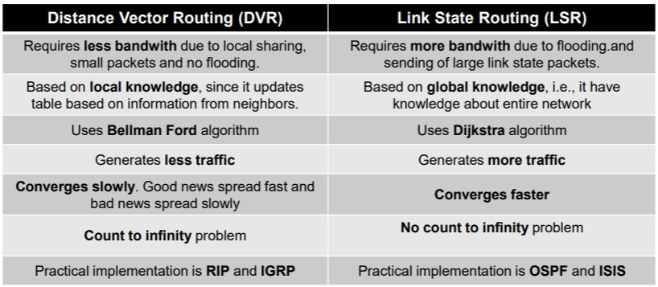

# Tercer parcial
* Dynamic algorithms
	* Distance Vector Routing | Bellman-Ford routing algorithm 
		* Each router maintains a table of best distances
			* Tables updated by exchanging information with neighbors
			* Table contents are:
				* The prefered outgoing line for that destination
				* The estimate of the distance for that destination
		* Used in:
			* The original ARPANET
			* The Internet as RIP
		* Convergence is slow but accurate
			* Convergence: The settling of routes to best paths across the network
			* Reacts rapidly to good news but slow for bad news
	* Link State Routing
		* Used in ARPANET before being replaced by Distance Vector Routing
		* Slow convergence
		* Each router must follow these steps:
			* Discover its neighbors
			* Set the distance
			* Construct a packet with that information
			* Send and receive this type of packets from other routers
				* With controlled flooding
				* Discarding duplicates or old data (packets have a number)
			* Compute the shortest path to every other router
		* Problems with sequence numbers (solved substracting a variable "age" until its zero):
			* If they wrap
			* Count is loss when the router crashes
			* If a sequence is corrupted it will be rejected

